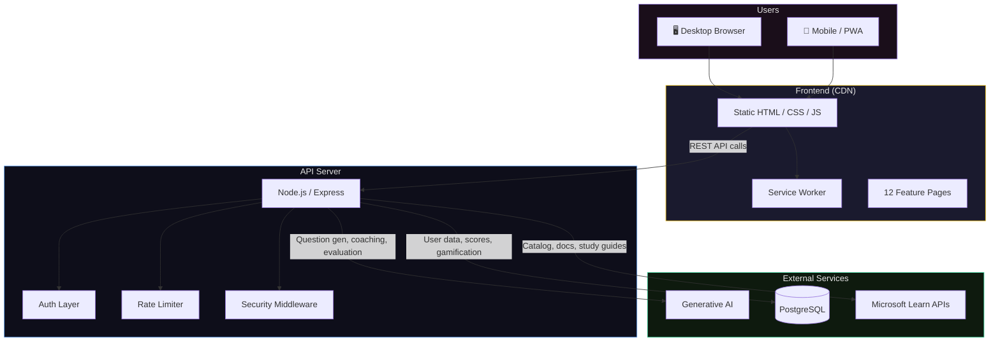
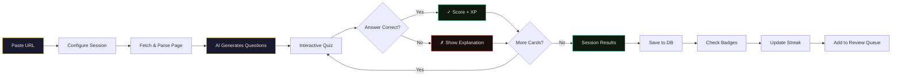
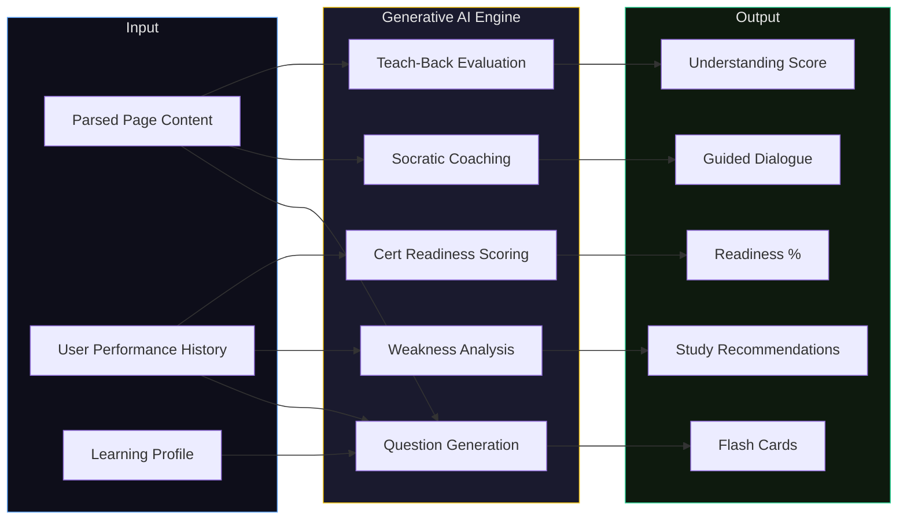
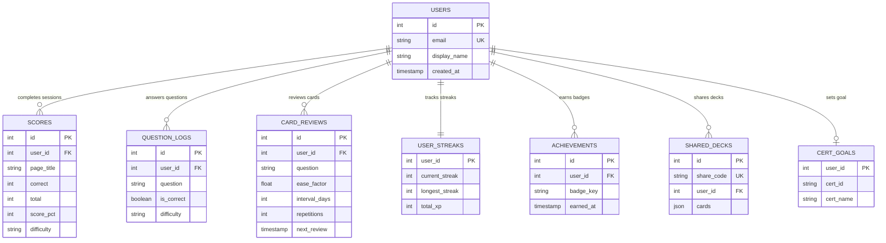
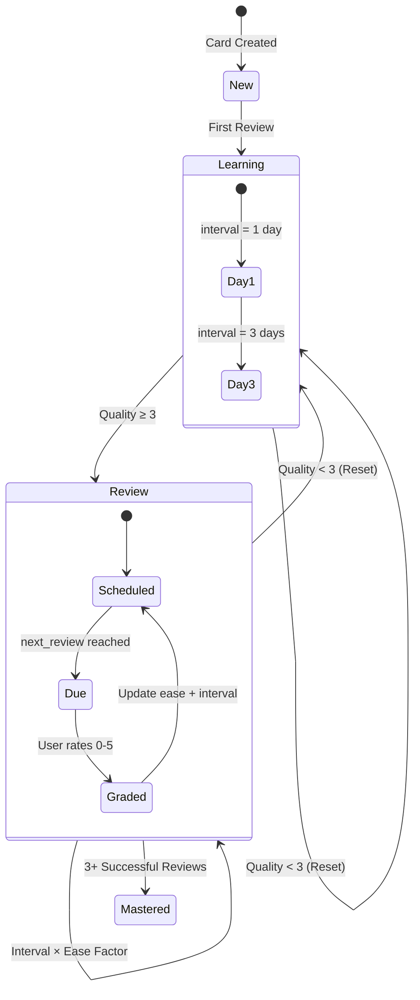
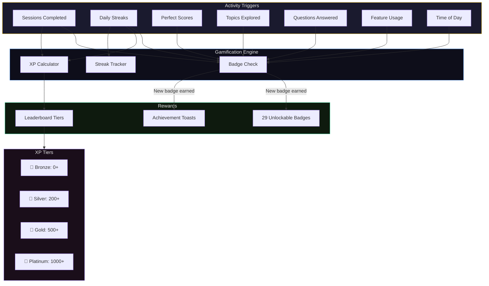
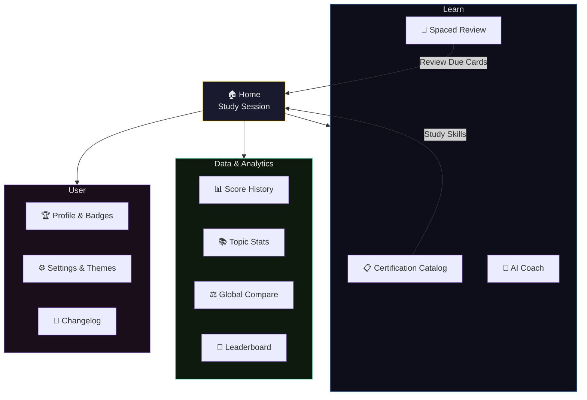
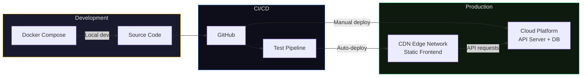

# Good Better Best

AI-powered study cards for Microsoft Learn — turn any documentation page into an interactive quiz session.

---

## Summary

Good Better Best is a full-stack web application that generates intelligent, adaptive flash cards from Microsoft Learn documentation. Users paste a URL, configure their session, and the app produces multiple question types — multiple choice, true/false, fill-in-the-blank, and scenario-based — powered by generative AI.

The platform includes user authentication, spaced repetition review, a gamification system with unlockable badges and XP-based leaderboards, AI coaching modes, a full Microsoft certification catalog, daily challenges, personalized weakness analysis, knowledge decay modeling, and a progressive web app experience.

Built as a solo project to explore the intersection of AI-assisted learning, adaptive difficulty, and modern web architecture.

---

## Features

- **AI Question Generation** — Multiple question types generated from parsed documentation, with adaptive difficulty based on performance history
- **Microsoft Certification Catalog** — Integration with the Microsoft Learn Catalog API covering certifications and applied skills, filterable by area, level, and type
- **Skills Tested Extraction** — Parses exam study guides to extract detailed competency lists for targeted study
- **Spaced Repetition** — SM-2 algorithm for optimized review intervals and long-term retention
- **Gamification** — Badges, XP, streaks, tiered leaderboards, daily challenges
- **Socratic AI Coach** — Conversational tutoring that asks probing questions instead of giving answers
- **Teach-Back Mode** — Users explain concepts; AI evaluates understanding and identifies misconceptions
- **Certification Readiness** — AI-powered readiness scoring against a user's target certification
- **Weakness Reports** — AI analyzes wrong-answer patterns and generates personalized study plans
- **Knowledge Decay Modeling** — Estimates retention over time and surfaces topics needing review
- **Themeable** — 15 color themes including dark/light variants
- **PWA** — Offline-capable progressive web app with service worker caching
- **Mobile Responsive** — Optimized layouts across all device sizes

---

## Technical Architecture

### System Overview

High-level view of how the frontend, API, and external services connect.




### User Flow — Study Session

The core learning loop from URL input to scored results.



### AI Integration Architecture

How generative AI is used across five distinct learning features.



### Data Model

Entity relationships for user data, learning progress, and gamification.



### Spaced Repetition Flow (SM-2)

How the review system schedules cards based on recall quality.



### Gamification System

Badge categories and XP progression through the tier system.



### Frontend Page Map

Navigation structure across the 12 feature pages.



### Deployment Architecture



---

## Services & Integrations

| Layer | Technology | Role |
|-------|-----------|------|
| Frontend | Static CDN | HTML/CSS/JS hosting with edge delivery |
| API | Node.js / Express | RESTful API server with auth and rate limiting |
| AI | Anthropic Claude | Question generation, coaching, evaluation |
| Database | PostgreSQL | User data, scores, reviews, gamification |
| Content | Microsoft Learn | Documentation content, certification catalog, study guides |
| CI/CD | GitHub Actions | Automated testing pipeline |

---

## Tech Stack

**Backend** — Node.js, Express, PostgreSQL, JWT authentication, security hardening, rate limiting

**Frontend** — Vanilla HTML/CSS/JS (no framework), Google Fonts, Lucide Icons, Chart.js, Service Worker (PWA)

**Infrastructure** — Docker, CI/CD pipeline, CDN-hosted frontend, managed database

---

## Running Locally

```bash
git clone https://github.com/justinericsnyder/FlashCards.git
cd FlashCards
npm install
cp .env.local .env
# Configure required environment variables in .env
npm run dev
```

Or with Docker:

```bash
docker-compose up --build
```

---

## License

MIT

---

© 2026 [JUSTINERICSNYDER.COM](https://www.justinericsnyder.com)
